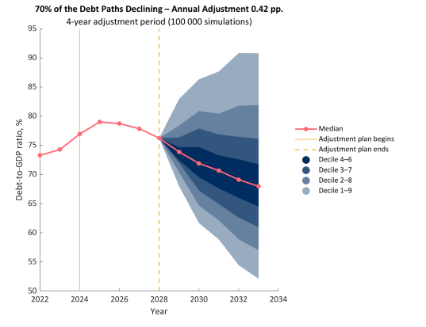
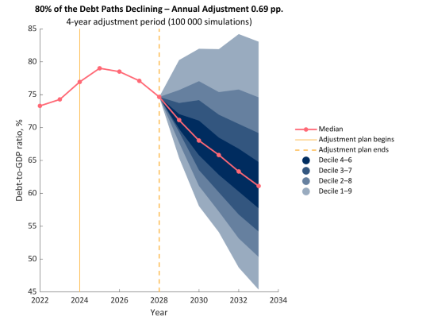

# Debt Sustainability Analysis (DSA) Tool - Version 4

## Overview
The Debt Sustainability Analysis (DSA) tool, now in its fourth version, is pivotal for debt ratio projections as seen in this [blog post](https://www.vtv.fi/en/blog/the-length-of-the-adjustment-plan-in-the-reformed-eu-debt-rules-is-of-great-importance-to-finland/). An enhancement from version 2, this version is highlighted in Chapter 3 of the [Fiscal Policy Monitoring Report 2023](https://www.vtv.fi/en/publications/fiscal-policy-monitoring-report-2023/), produced by NAOF's Fiscal Policy Monitoring Unit.

### Compatibility
The tool is compatible with Windows 10 (64-bit) and MATLAB R2020b.

### Components Required
To execute this MATLAB code, you'll need:

1. **Main Function:** `runDsaStochModel4_blog.m`
2. **Helper Functions:**
   - `project_debt4v.m` - Projects debt paths considering yearly adjustments.
   - `sumq2y.m` - Converts quarterly shocks to yearly data.
   - `formatWithSpaces.m` - Ensures numbers in figures are formatted for readability.
3. **Data File:** `AmecoFinlandData4v_1.xlsx`

### DSA Criteria ###
The current version 4 does not include (yet) all the criteria used in the reformed EU Fiscal Rules.
Also, it does not consider updated SFA considerations for Finland.

- **Incorporated Criteria:**
  - DSA-based criteria, including both deterministic and stochastic scenarios.
  - The Debt Sustainability Safeguard as outlined in [article 6a](https://www.consilium.europa.eu/media/70386/st06645-re01-en24.pdf).

### Scenarios and Customization
The tool facilitates debt projections following the guidelines of the European Commission's [Debt Sustainability Monitor 2023](https://economy-finance.ec.europa.eu/publications/debt-sustainability-monitor-2023_en). The code has benefitted greatly from the analysis and Python code by Darvas et al. (2023), as seen [here](https://www.bruegel.org/working-paper/quantitative-evaluation-european-commissions-fiscal-governance-proposal) and [here](https://github.com/lennardwelslau/eu-debt-sustainability-analysis). It supports various scenarios, including baseline adjustment, lower SPB, adverse r-g, and financial stress. Users have the option to select the SFA method either as per the Commission's assumption or an alternative (bootstrap) approach. Other selections can also be made.

### Data and Adjustments
The file `AmecoFinlandData4v_1.xlsx` contains all necessary data for the tool. Users can modify parameters for sensitivity analysis and select options for plotting, language preference, and saving.

### Contact
For any inquiries or feedback, please contact peetu.keskinen@vtv.fi.

## How to Reproduce Figures in the Blog Post

To replicate figures from the [blog post](https://www.vtv.fi/en/blog/the-length-of-the-adjustment-plan-in-the-reformed-eu-debt-rules-is-of-great-importance-to-finland/), use commands below in MATLAB.
Please note that it takes some time to produce 100 000 simulations. User can reduce the number of simulations by changing 5th argument in the function (see details below). Recommended minimum number of simulations are 1000.

### Figure 1
```matlab
runDsaStochModel4_blog(0,1,1,0,5,7,1,1,0)
```


**Configuration:** COM SFA Zero Assumption, Adjustment scenario, no Debt Safeguard, no Plotting, 100 000 simulations, *70% plausibility*, English output, *Normal simulation method*, no output saving.

### Figure 2
```matlab
runDsaStochModel4_blog(0,1,1,0,5,7,1,2,0)
```


**Configuration:** COM SFA Zero Assumption, Adjustment scenario, no Debt Safeguard, no Plotting, 100 000 simulations, *70% plausibility*, English output, *Bootstrap simulation method*, no output saving.

### Figure 3
```matlab
runDsaStochModel4_blog(0,1,1,0,5,8,1,2,0)
```


**Configuration:** COM SFA Zero Assumption, Adjustment scenario, no Debt Safeguard, no Plotting, 100 000 simulations, *80% plausibility*, English output, *Bootstrap simulation method*, no output saving.

### Configuration Options
- **SFA Method:**
  - 0 for COM ZERO ASSUMPTION
  - -1 for ALTERNATIVE ASSUMPTION
- **Scenario:**
  - 1 for ADJUSTMENT
  - 2 for LOWER SPB
  - 3 for ADVERSE r-g
  - 4 for FINANCIAL STRESS
- **Debt Safeguard:**
  - 1 to apply
  - 0 not to apply
- **Plotting:**
  - 1 to enable
  - 0 to disable
- **Stochastic Samples:** Power of 10 (e.g., 1 for 10, 2 for 100, etc.)
- **Plausibility Value:**
  - 7 for 70%
  - 8 for 80%
  - 9 for 90%
- **Language for Stochastic Plots:**
  - 1 for English
  - 2 for Suomi
  - 3 for Swedish
- **Stochastic Method:**
  - 1 for Normal
  - 2 for Bootstrap
- **Save results as .mat (Optional):**
  - 1 to save
  - 0 not to save


